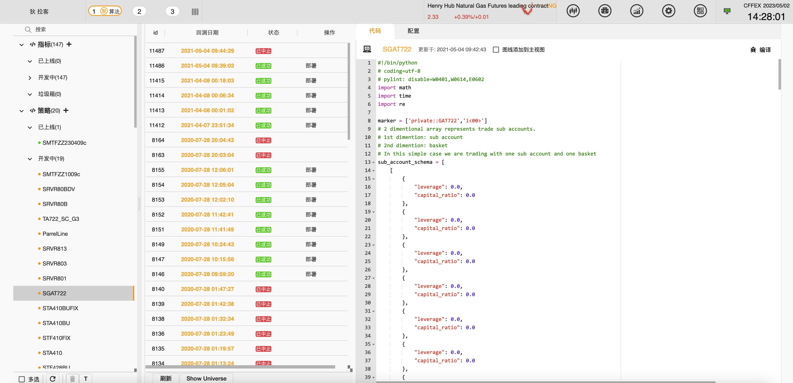
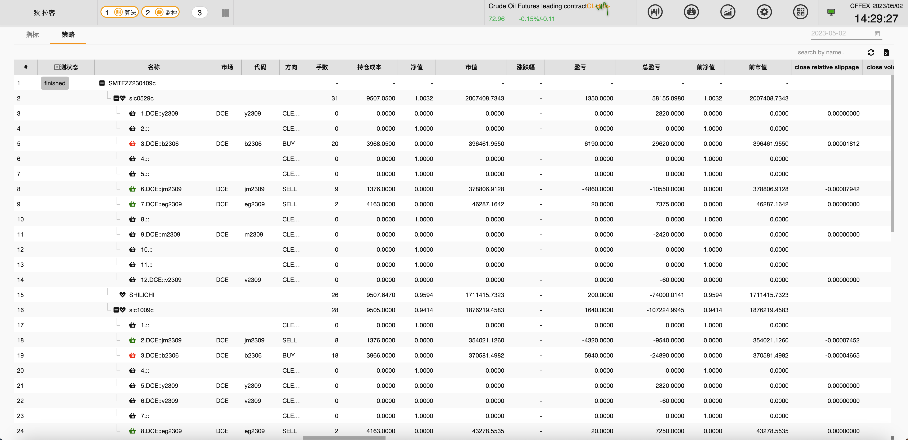
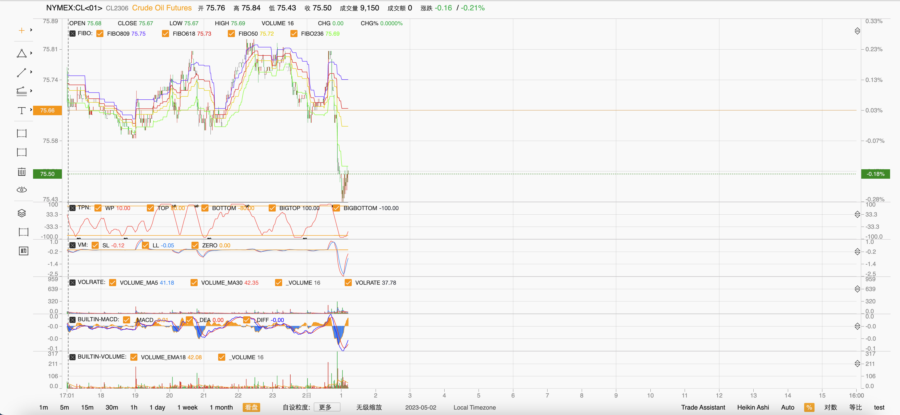
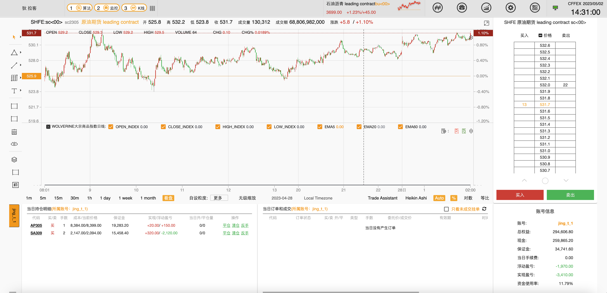

# Getting started







## Download Docker Images

Wolverine OS provides two Docker image families:

* **wos-dev**: This is a lightweight Docker image that is designed to work with well-maintained service environments. It is typically used for developing indicators and other algorithm-based applications. The image provides a range of tools and utilities for development and testing, including C++ libraries, Python packages, and other dependencies.

* **wos-dev-s**: This is a heavier Docker image that provides a standalone environment for developing and testing trading strategies. It includes all the backend web services and C++ infrastructure needed to build a standalone environment without relying on external service environments. The image is designed for more advanced development work, such as extending the C++ services or building Python-C++ modules.

Both Docker images provide a convenient and portable way to work with Wolverine OS. They allow you to quickly set up and configure an environment for developing and testing trading strategies, without having to worry about dependencies or installation issues. Whether you're a quantitative trader, a financial analyst, or a software developer, Wolverine OS Docker images provide a powerful and flexible platform for developing and testing trading strategies in a secure and reliable environment.

`wos-dev-s` is an excellent all-in-one starting point that is suitable for individual or medium team users with small to medium data and computing scale requirements. However, it is not yet ready for use in very large-scale practices, such as providing data and computing capabilities to a large community which is the designated function scope of our project. For such use cases, Kubernetes can be used to extend wos-dev-s to a highly scalable state, allowing for the use of many CPUs and GPUs across multiple physical or virtual hosts. With Kubernetes, Wolverine OS can scale to meet the needs of even the most demanding trading strategies and financial quantitative experiments.

### Intel X86_64 architectures

#### Development environment

```
docker pull glacierx/wos-dev
```

```
docker pull glacierx/wos-dev-s
```

#### Production environment

```
docker pull glacierx/wos-dev-prod
```

```
docker pull glacierx/wos-dev-s-prod
```

### Apple Silicon or other aarch64 architechures:

#### Development environment

```
docker pull glacierx/wos-dev-arm64
```

```
docker pull glacierx/wos-dev-s-arm64
```

#### Production environment

```
docker pull glacierx/wos-dev-prod-arm64
```

```
docker pull glacierx/wos-dev-s-prod-arm64
```

## A brief introduction to Wolverine OS

Wolverine OS is a reliable and battle-tested virtual operating system designed for financial quantitative experiments, manual and automated trading, and risk management. It is built as a docker container-based system, making it easy to deploy and use on a variety of platforms.

Wolverine OS includes a range of features for developing and executing trading strategies, including simulated trading accounts with real-time market data, indicator-based development and backtesting, and debugging and monitoring tools. The system also includes risk management and compliance functions, ensuring that trading activities comply with regulatory requirements.

Wolverine OS is based on a scalable design and has been developed over the years to include a wide range of C++-based services and an API-based management web site backend. The system has been used to execute live trade signals in different markets around the world for a long time, demonstrating its reliability and stability in production environments.

Whether you're a quantitative trader, a financial analyst, or a software developer, Wolverine OS provides a powerful and flexible platform for developing and testing trading strategies in a secure and reliable environment.


Wolverine OS consists of two main executable branches:

* **Dev**: This branch should be used with the dev service environment, unless you are using the wos-dev-s Docker container to build a standalone environment without a global data repository. Please note that the dev branch is only compatible with the dev service environment. If you try to send requests from a wos-dev container to wos-dev-s-prod services, undefined behavior may occur.

* **Prod**: This branch should be used with the production service environment. Please note that the dev branch is not compatible with the prod branch.

The Wolverine OS system is designed to have two main parts:

* **Global**: This is a read-only data repository that provides global market real-time and historical multi-timeframe sampled data. Global environment is maintained by us. If you want to build your own private environment from scratch, the best practice is to work with the global environment. However, please note that we do not publicly give access to our global service. If you are interested, please contact us.

* **Private**: This is a writable data repository that users can use to perform experiments and trading practices. A system without access to the global repository can exist without any issues. If you don't want to use out-of-the-box data and services  which will involve global environment to perform experiments, you can run a standalone private-only system and use indicator-based solutions or our open API to develop an advanced data pumping service, such as dirac-client, to import raw data. You can then use the algorithm development module to process and generate more indicators as needed.

By separating the global and private repositories, Wolverine OS provides a flexible and secure environment for developing and testing trading strategies. The dev and prod branches also provide different levels of compatibility with service environments, allowing you to choose the appropriate branch for your needs.

### Chart


The chart module in Wolverine OS provides a rich and interactive visual environment for developing and testing trading strategies. The chart module is designed to be easy to use, with a range of both dedicated algorithm models in python and simple one-ticker indicator in formula language (we call it Feynman language after the great Nobel prize winner) for drawing fancy charts and indicator widgets.

If you are familiar with Chinese financial software, you will appreciate the ability to import simple one-ticker indicator source code and seamlessly see the results in the chart module. The module also supports multi-timeframe sampled data, allowing for detailed analysis and candlestick-based strategies.

In addition to its powerful visualization capabilities, the chart module also includes an embedded order entry module, allowing for seamless trade execution and monitoring. User doodles can also be created using the indicator language, providing a flexible and customizable environment for experimentation and analysis.

Whether you're a quantitative trader, a financial analyst, or a software developer, Wolverine OS chart module provides a powerful and flexible platform for developing and testing trading strategies in a secure and reliable environment. With its rich and interactive graphics and advanced analysis tools, the chart module is the perfect tool for exploring market trends and developing new trading strategies.

### Formula

#### Feynman Language

Feynman language is based on a popular single-ticker indicator language that can be found in Wind (万得), Straight Flush (同花顺), and many similar competitors. However, Feynman language offers more features than the original version of the indicator language, including:

* **User-defined functions**: users can define their own functions and incorporate them with their dedicate designed python algorithm models.

* **Global cross-references**: Feynman language allows for cross-referencing data from both the user-authored indicators or those indicators user authorized to access. Fields of those indicators can be referenced in one piece of formula easily.

* **Doodles**: users can create custom graphical elements and annotations to enhance their analysis and visualization of market data.

* **Seamless data interface**: Feynman language provides a seamless interface between global and private dual environments, making it easy to access and analyze data from multiple sources.


Overall, Feynman language provides a powerful and flexible platform for developing and testing trading strategies in Wolverine OS. Whether you're a quantitative trader, a financial analyst, or a software developer, Feynman language offers a range of features and capabilities that make it easy to build sophisticated trading strategies and algorithms.

BOLL

```
variable : N= 15, P= 3, BBI=0;
BBI:=(MA(CLOSE,3)+MA(CLOSE,6)+MA(CLOSE,12)+MA(CLOSE,24))/4;
DWN:(BBI-P*STD(BBI,N)),LINETHICK1, COLORFF0000;
UPR:(BBI+P*STD(BBI,N)),LINETHICK1, COLORFFA13B;
MID: BBI, LINETHICK1, COLOR7E7AFF;
```

More dedicated example used with python algorithm and cross referencing.

```
xref: w = "{market}/{code}/TQF1210_1H_L3/wp";
line(time_tag[1],80,time_tag,80,"COLOR:00BCD4,LINETHICK:1,STYLE:solid");
line(time_tag[1],-80,time_tag,-80,"COLOR:00BCD4,LINETHICK:1,STYLE:solid");
wp: w, LINETHICK:2, COLOR:FF9800,STYLE:line;
```

Here `w` is a cross reference to a field `wp` of a python model named `TQF1210_1H_L3` developed by our user.

### Model Development

Wolverine OS is designed for dedicated quantitative model development and experimentation. It provides a powerful platform for developing quantitative models ranging from simple dual moving average trend following strategies to deep neural network-based models.

For integrated graphical development environments, VSCode is a popular choice. Users can use VSCode in native or remote mode to develop, debug, and monitor their models. Wolverine OS also supports a range of other development environments and tools, making it easy to work with the platform in a way that best suits your needs and preferences.


#### Backtest

Backtesting is a critical process for quantitative model development and experimentation. Wolverine OS provides a flexible and powerful backtesting subsystem that supports multiple development languages, including Python3, which is the language we highly recommend.

The core and resource-intensive parts of the backtesting subsystem are developed using high-performance C++ language, with a variety of language bindings provided. Both single CPU core mode and multiple CPU core mode are supported, and in the latter case, a cluster of physical hosts or GPUs can be used to accelerate the process significantly.

Users can choose to use an IDE within the application or VSCode for backtesting, and auto code completion and model templates are available to streamline the process. With Wolverine OS, you can easily develop and test sophisticated quantitative models and trading strategies, giving you the tools you need to succeed in today's dynamic financial markets.

#### Indictator

#### Strategy

### Mark To Market

### Account Management

## Examples

This repository is to demonstrate the basic usage of `glacierx/wos-dev` image and `glacierx/wos-dev-s` image. They are designed to provide indicator based development, debugging, monitoring functions and a all-in-one standalone server and client envirionment for testing and devlopment purpose respectively.

You can find many templates of indicators development on Wolverine OS. 


## Support